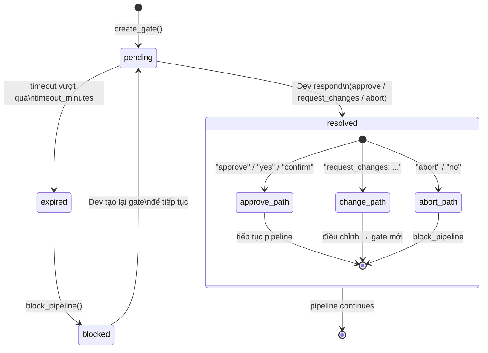

# HITL — Human-In-The-Loop Gate Protocol

Gates là cơ chế chính thức để pipeline **pause và chờ human** quyết định.
Khác với text "DỪNG — Chờ Dev" (instruction dễ bị LLM bỏ qua), gate là dữ liệu
được lưu vào pipeline state — recoverable across sessions.

---

## Gate Types

| Type | Dùng khi | Dev respond bằng |
|------|----------|-----------------|
| `REVIEW` | Cần Dev xem artifact (approach, code chunk, design) | "approve" / "request_changes: [comment]" |
| `APPROVE` | Cần yes/no đơn giản | "yes" / "no" |
| `CHOICE` | Dev phải chọn 1 trong N options | Tên option đã chọn |
| `CONFIRM` | Trước action quan trọng (commit, push, delete) | "confirm" / "abort" |
| `UNBLOCK` | Pipeline stuck, human phải quyết định hướng đi | Mô tả action cần làm |

---

## Gate Lifecycle



---

## Cách sử dụng trong Skills

### 1 — Tạo gate (pipeline pauses)

```python
result = morai-pipeline: create_gate(
    ticket_id="PROJ-123",
    gate_type="REVIEW",
    question="Approach plan for TASK-1: Add user authentication",
    context="""
    Files to change: src/auth/handler.go, src/middleware/jwt.go
    Pattern: follow existing auth patterns in src/auth/oauth.go
    Tests: auth_test.go (add 3 cases)
    """,
    timeout_minutes=120,  # 2 giờ default
)
gate_id = result["gate_id"]  # e.g. "PROJ-123-gate-001"
```

**Hiển thị cho Dev ngay sau khi tạo:**

```markdown
⏸ GATE [PROJ-123-gate-001] — REVIEW

**Approach: TASK-1 Add user authentication**

Files sẽ thay đổi: src/auth/handler.go, src/middleware/jwt.go
Pattern tham chiếu: src/auth/oauth.go
Tests cần thêm: 3 cases trong auth_test.go

Anh xem thử approach này, em đợi approve để bắt đầu implement.
(Gate expire sau 2 giờ nếu không respond)
```

### 2 — Chờ Dev respond

Pipeline ở trạng thái chờ. **Không làm gì thêm** cho đến khi Dev respond.

Khi Dev respond (bất kỳ message nào sau khi gate được tạo):

```python
morai-pipeline: resolve_gate(
    ticket_id="PROJ-123",
    gate_id="PROJ-123-gate-001",
    response="approve"  # hoặc "request_changes: dùng bcrypt thay vì SHA256"
)
```

### 3 — Xử lý response

```python
gate = morai-pipeline: get_gate("PROJ-123", "PROJ-123-gate-001")

match gate["response"]:
    case "approve" | "yes" | "confirm":
        → Tiếp tục pipeline từ điểm bị pause

    case str(r) if r.startswith("request_changes"):
        comment = r.split(":", 1)[1].strip()
        → Điều chỉnh theo comment → tạo gate mới (loop approach)

    case "abort" | "no":
        → morai-pipeline: block_pipeline(ticket_id, "User aborted at gate")
        → Báo cáo cho Dev
```

### 4 — Xử lý expired gate

```python
gate = morai-pipeline: get_gate(ticket_id, gate_id)

if gate["status"] == "expired":
    → morai-pipeline: block_pipeline(ticket_id,
        reason=f"Gate {gate_id} expired after {gate['timeout_minutes']}min without response")
    → Báo Dev: "Gate PROJ-123-gate-001 đã hết hạn (2h). Anh muốn tiếp tục không?"
```

---

## Gate Table — Mọi gate được create trong pipeline

| Gate | Skill | Type | Trigger | Timeout |
|------|-------|------|---------|---------|
| GATE 1 — Approach | dev | REVIEW | Sau research, trước implement | 120 phút |
| GATE 1 — Agg. Approach | spawner | REVIEW | Tất cả sub-agents approach_ready | 120 phút |
| GATE 2 — Commit | dev | CONFIRM | Trước git commit | 60 phút |
| GATE 3 — Push & PR | dev | CONFIRM | Trước git push + create_pr | 60 phút |
| Clarification | ba | APPROVE | Spec thiếu critical info | 240 phút |
| Security BLOCK | security | UNBLOCK | Verdict = BLOCK, chặn advance QA | 480 phút |

> **GATE 2 và 3** trong dev guided mode: Dev nói "commit" / "tạo PR" trong chat là đủ
> để resolve — không cần navigate vào pipeline UI. Gate vẫn được tạo để log và recovery.

---

## Session Recovery — Pending Gates

Khi session mới bắt đầu, `recall.md` gọi:

```python
pending = morai-pipeline: list_all_pending_gates()
```

Nếu có pending gates, hiển thị ngay trước khi báo cáo pipeline state:

```markdown
## Pending Gates — cần Dev resolve

⚠️ PROJ-123-gate-001 [REVIEW] — Approach: TASK-1 Add auth
   Created: 2026-05-15 10:30 UTC | Expires: 2026-05-15 12:30 UTC
   → "approve" / "request_changes: [comment]"

⚠️ PROJ-456-gate-002 [UNBLOCK] — Security BLOCK on PR #45
   Created: 2026-05-15 09:00 UTC | Expires: 2026-05-15 17:00 UTC
   → Mô tả action cần làm
```

---

## Anti-patterns — Không làm

```
✗ Tạo gate rồi tiếp tục implement không chờ response
✗ Tạo gate nhưng không hiển thị rõ ràng cho Dev
✗ Resolve gate với response giả ("auto approve")
✗ Bỏ qua expired gate, tiếp tục pipeline
✗ Tạo nhiều gates cho cùng 1 decision (1 gate per decision)
```

---

## Format hiển thị chuẩn

```markdown
⏸ GATE [{gate_id}] — {gate_type}

**{question}**

{context}

{options nếu CHOICE: "Options: A / B / C"}
{timeout info: "Expire sau {timeout_minutes} phút"}
```

Khi resolved:
```markdown
✅ GATE [{gate_id}] resolved — "{response}"
→ Tiếp tục: {next action}
```

Khi expired:
```markdown
⌛ GATE [{gate_id}] expired
→ Pipeline BLOCKED. Anh muốn tạo lại gate để tiếp tục?
```
