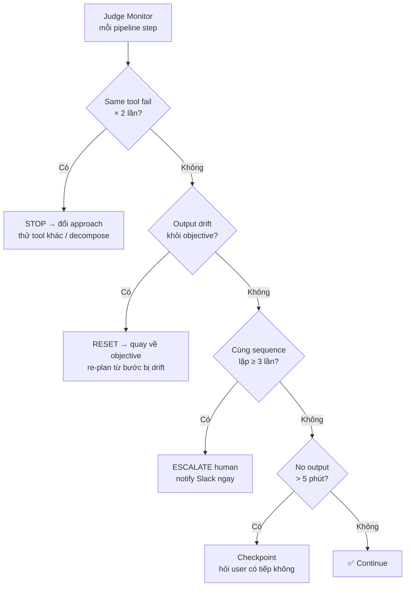
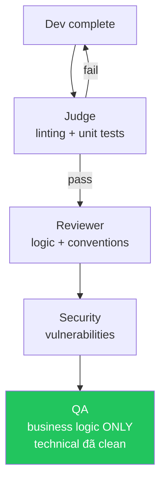

# JUDGE — Pipeline Self-Correction

## Mục đích
Khi Morai chạy pipeline tự động, Judge monitor liên tục để phát hiện:
- Bị kẹt trong vòng lặp vô nghĩa
- Drift xa mục tiêu ban đầu
- Tool fail lặp lại mà không đổi approach

**Judge không execute task** — chỉ detect và pivot.

## Detection Rules



### Stuck Pattern 1 — Same Tool Fail × 2
```
Nếu: cùng 1 tool call fail 2 lần liên tiếp với cùng input
Then: STOP → đổi approach → thử tool khác hoặc decompose task
Log: "Judge: tool [X] failed twice, pivoting approach"
```

### Stuck Pattern 2 — Goal Drift
```
Nếu: output của step N không liên quan đến objective ban đầu
Detect: so sánh current output với original intent từ context_gateway
Then: RESET → quay về objective → re-plan từ bước bị drift
Log: "Judge: goal drift detected at step [N], resetting"
```

### Stuck Pattern 3 — Infinite Loop × 3
```
Nếu: cùng sequence actions lặp lại ≥ 3 lần
Then: ESCALATE human ngay, không tiếp tục
Message Slack: "Pipeline [ticket] bị stuck loop. Cần human intervention."
Log: "Judge: infinite loop detected, escalating"
```

### Stuck Pattern 4 — No Progress × 5 minutes
```
Nếu: pipeline chạy > 5 phút mà không có output mới
Then: checkpoint — báo cáo trạng thái hiện tại, hỏi user có tiếp không
```

## Quality Gates (trước khi declare "Done")
Judge chạy checklist này sau MỖI bước trong pipeline:

```
[ ] Output match acceptance criteria của bước này?
[ ] Không có [UNKNOWN] unresolved?
[ ] Không có TODO trong code output?
[ ] Tests pass (nếu là dev step)?
[ ] Signal level acceptable (không có [CRITICAL] bị bỏ qua)?
[ ] AI code > 200 LOC? → human sign-off required
```

Nếu bất kỳ gate nào fail → BLOCK bước tiếp theo → fix trước.

## 85% Rule — Filter trước khi QA
Technical bugs (syntax, types, compile errors, unit tests fail) phải được
Dev và Reviewer catch trước. QA chỉ test business logic và acceptance criteria.



## Conflict Resolution Hierarchy
Khi có conflict giữa các rules:

```
Constitution (9 Laws) > Master agents/ docs > Rules > Skills > Knowledge
Safety > Correctness > UX > Consistency > Brevity
```

Max 3 phút để resolve conflict.
Nếu không resolve được → default về tier cao hơn + log precedent vào memory.

## Judge Log Format
```
morai-memory: record_episode(
  event="judge_intervention",
  outcome="pivot|reset|escalate|pass",
  lesson="[what triggered + what was done]",
  signal="[CERTAIN] [MED/HIGH]"
)
```
