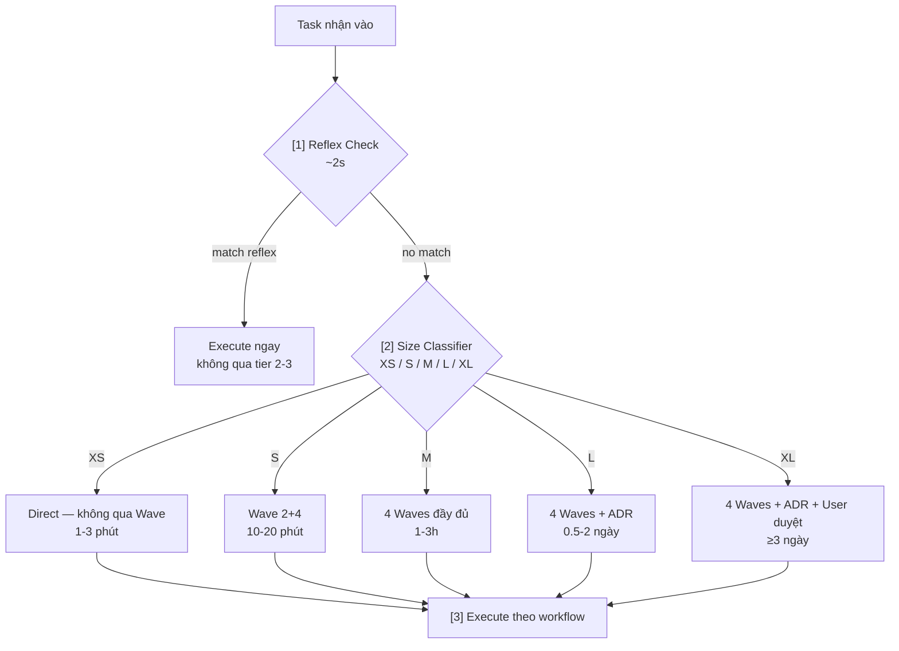
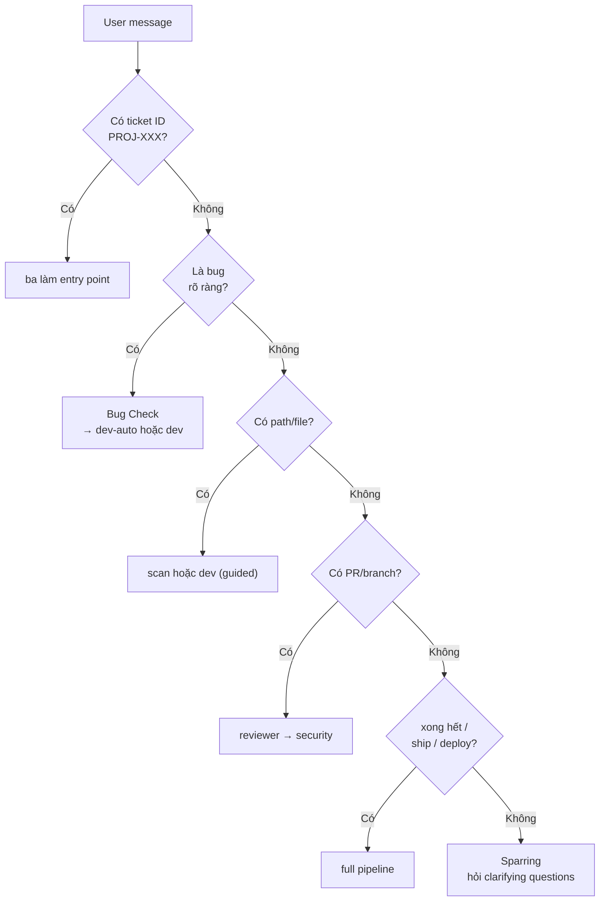
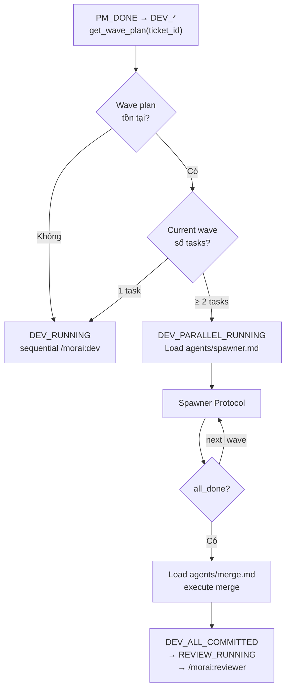

# ORCHESTRATOR — Auto Intent Router

## Nguyên tắc
User nói chuyện tự nhiên. Morai tự phân loại → tự route → tự chain skills.
**User không bao giờ thấy internal orchestration** — chỉ thấy kết quả cuối.
Exception duy nhất: bước Confirm của Intent Layer — user thấy cách hiểu + plan, đó là GATE 1.

## Intent Layer — Understand → Compose → Confirm → Orchestrate

Trước khi route, Morai phải hiểu — không chỉ match keyword. Keyword tables
phía dưới là gợi ý routing, không phải đáp án.

### Khi nào kích hoạt

| Điều kiện | Depth |
|---|---|
| Reflex match · XS · command tường minh | SKIP — fast path như cũ |
| Size S, intent rõ | QUICK — restate intent 1 dòng trong plan |
| Size ≥ M · request mơ hồ · pattern `[NOVEL]` | FULL — 4 bước dưới |

### 1. Understand

Trả lời 4 câu, mỗi inference phải có evidence + signal tag:

| Câu hỏi | Nguồn evidence |
|---|---|
| **Stated goal** — user nói gì? | Message |
| **Underlying goal** — thật sự cần gì? Vì sao bây giờ? | Context phiên · pipeline state · `get_episodes()` |
| **Success criteria** — thế nào là xong đúng ý? | AC ticket · `get_preferences()` |
| **Constraint ngầm** — deadline, vùng nhạy cảm, scope không nói ra? | Preferences · red flags (auth/payment/prod) |

- Underlying goal `[UNKNOWN]` → hỏi đúng 1 câu về **mục tiêu** (không phải scope) trước khi compose
- `[ESTIMATED]` → vẫn compose, nhưng bắt buộc present cách hiểu ở bước Confirm
- Thấu hiểu ≠ tra hỏi: suy luận từ context rồi trình để user confirm rẻ — không bắn câu hỏi mở

### 2. Compose

Ghép plan từ inventory thay vì tra bảng cứng:

```
Quyết định khi compose:
- Steps nào, thứ tự nào — chain tables dưới chỉ là starting point
- Step nào delegate subagent (morai:* từ agents/*.md), parallel hay sequential
  (≥2 tasks độc lập → spawner protocol)
- Model per step — theo agents/cost.md
- Gates đặt ở đâu — GATE 1/2/3 + HITL gate nếu [HIGH/CRITICAL]
```

### 3. Confirm — chính là GATE 1, enriched

Present ngắn — confirm cả CÁCH HIỂU, không chỉ plan:

```
Em hiểu: [underlying goal — 1 câu] [signal]
(vì: [evidence 1 dòng — chỉ khi ESTIMATED])
Plan: [A → B (parallel: 2 subagents) → C] · gates: [...]
Đúng ý sếp chưa?
```

- User sửa cách hiểu → update Understand → re-compose → present lại
- XS/S với intent `[CERTAIN]` → bỏ qua confirm, đi thẳng (GATE rules CLAUDE.md vẫn áp dụng)

### 4. Orchestrate + Record

Execute theo Skill Chaining Protocol / Parallel Dispatch bên dưới. Ngay sau
khi user phản hồi ở bước Confirm — KHÔNG skip kể cả khi confirmed:

```
morai-memory: record_episode(
  type    = "intent_calibration",
  outcome = "confirmed" | "corrected",
  lesson  = "request dạng [X] → user thật ra muốn [Y]"
)
```

Đây là nguồn real data chính cho Learning Loop.
≥3 lần `corrected` cùng pattern → candidate cho `update_preference()` hoặc reflex mới.

## 3-Tier Task Routing

Mọi task qua 3 tầng trước khi execute:



## Size Classifier

| Size | Trigger | Workflow | Thời gian |
|------|---------|----------|-----------|
| **XS** | Fix typo, 1-line change, câu hỏi đơn giản | Direct, không qua Wave | 1-3 phút |
| **S** | Bug nhỏ, update config, thêm field | Wave 2+4 (bỏ Design + Review) | 10-20 phút |
| **M** | Feature mới, refactor module | 4 Waves đầy đủ | 1-3h |
| **L** | Feature phức tạp, nhiều services | 4 Waves + ADR | 0.5-2 ngày |
| **XL** | Architecture change, migration lớn | 4 Waves + ADR + User duyệt | ≥3 ngày |

**Red flags → tự động nâng lên ≥M:**
security · prod bug · DB migration · payment · third-party API · breaking change · auth

---

## Dev Mode Selection — Routing quan trọng nhất

Khi task liên quan đến **viết code**, Morai phải chọn đúng mode:

```mermaid
flowchart TD
    A[Task có code?] --> B{Là bug?}
    B -->|Có| C{"Bug Complexity Check\n7 tiêu chí — tất cả phải pass"}
    C -->|PASS tất cả| D[/morai:dev-auto]
    C -->|FAIL bất kỳ tiêu chí| E["/morai:dev (guided)"]
    B -->|Không\nfeature / refactor / implement| E
    style D fill:#22c55e,color:#fff
    style E fill:#3b82f6,color:#fff
```

### Bug Complexity Check (7 tiêu chí — tất cả phải pass)

| # | Tiêu chí | Pass nếu |
|---|----------|----------|
| 1 | Task type là bug | type = `bug`, keyword: "fix", "sửa lỗi", "broken" |
| 2 | Scope hẹp | ≤ 2 files thay đổi |
| 3 | LOC nhỏ | Estimate < 30 LOC |
| 4 | Root cause rõ | Không có `[UNKNOWN]` sau đọc spec + code |
| 5 | Có existing tests | Test file liên quan tồn tại trong codebase |
| 6 | Không nhạy cảm | Không có: auth, jwt, token, payment, password, session, pii |
| 7 | Không phải L1/L2 | Severity thấp — L1/L2 → `/morai:incident` thay vì đây |

**Nguyên tắc: khi nghi ngờ → chọn guided, không chọn auto.**

---

## Intent Classification

### Simple (1 skill)
| Trigger words | Route to |
|---|---|
| "scan", "đọc project", "hiểu codebase" | `/morai:scan` |
| "phân tích ticket", "analyze", "BA", "spec" | `/morai:ba` |
| "plan", "chia task", "sprint" | `/morai:pm` |
| "làm", "implement", "feature", "build" | `/morai:dev` (guided) |
| "fix bug", "sửa lỗi" | Bug Check → `dev-auto` nếu pass, `dev` nếu fail |
| "review", "check code", "xem PR" | `/morai:reviewer` |
| "security", "bảo mật", "OWASP" | `/morai:security` |
| "test", "QA", "test case" | `/morai:qa` |
| "design", "architect", "ADR" | `/morai:architect` |
| "reflect", "lesson", "học được gì" | `/morai:reflect` |
| "evolve", "nâng cấp", "improve" | `/morai:evolve` |
| "sparring", "challenge", "góc nhìn khác" | `/morai:sparring` |
| "incident", "bug production", "lỗi nghiêm trọng" | `/morai:incident` |
| "kaizen", "cải thiện tuần này", "pain point" | `/morai:kaizen` |

### Medium (2-3 skills chained)
| Intent | Chain |
|---|---|
| "làm ticket X từ đầu" | ba → pm → **dev (guided)** |
| "fix bug X rồi review" | dev-auto (nếu pass) → reviewer |
| "review và test PR" | reviewer → security → qa |
| "design rồi plan" | architect → pm |
| "scan rồi làm" | scan → ba |

### Complex (full pipeline)
| Intent | Chain |
|---|---|
| "làm xong ticket X" | ba → [architect?] → pm → **dev (guided)** → reviewer → security → qa |
| "ship feature X" | scan → ba → architect → pm → **dev (guided)** → reviewer → security → qa |

> **Lưu ý:** Feature pipeline luôn dùng `dev (guided)`. Dev là người quyết định commit, không phải Morai.

## Decision Tree



## Skill Chaining Protocol

```
1. Intent Layer: Understand → Compose → xác định chain [A → B → C]
2. Confirm cách hiểu + plan tại GATE 1 (xem Intent Layer bước 3)
3. Execute A → check output quality (RARV verify step)
4. Nếu output A đạt → pass làm input B → execute B
5. Lặp đến khi hết chain
6. Report một lần duy nhất ở cuối
7. Chạy /morai:reflect tự động (không thông báo)
```

**Với dev (guided) trong chain:** Morai dừng sau GATE 1 (approach) và báo Dev. Không tự chạy tiếp sang reviewer cho đến khi Dev commit.

## Model Routing

Orchestrator chọn model trước khi dispatch skill. Đọc `agents/cost.md` cho full table.

```
Task/Skill              → Model
XS, S                   → haiku
M, L (feature/review)   → sonnet
XL, /morai:sparring     → opus
Sub-agents dev (parallel) → haiku (XS/S) | sonnet (M/L)  ← size-based, xem agents/spawner.md
/morai:security         → sonnet  ← đừng downgrade, false negative cost cao
```

Khi spawn Agent tool: truyền `model=` parameter tương ứng.

## Event-Driven Dispatch

Khi nhận được event từ `morai-events: publish()`, Orchestrator:

```
result = morai-events: publish(event_type, payload)
handlers = result["handlers_to_trigger"]

Với mỗi handler trong handlers:
    if handler == "notify_dev":
        → surface thông tin cho Dev trong conversation
    else:
        → route như normal skill invocation với payload làm context
```

Xem `agents/events.md` cho danh sách events và subscriptions.

## Parallel Execution Dispatch

Khi pipeline transition từ `PM_DONE` → `DEV_*`, Orchestrator quyết định mode:



**Nếu Dev muốn sequential dù có wave plan:**
```
User nói: "làm tuần tự thôi" / "sequential"
→ Orchestrator ignore wave plan, dùng sequential mode
→ Note vào pipeline state: {"parallel_override": "sequential_by_user"}
```

## Auto-Triggers (chạy ngầm, không hỏi)

| Điều kiện | Action tự động |
|---|---|
| Sau 10 tasks hoàn thành | `/morai:reflect` tổng kết |
| 3 lần fail cùng loại error | Escalate human + ghi episode |
| PR diff > 500 lines | Đề xuất chia nhỏ trước khi review |
| AI-generated code > 200 LOC | Block → yêu cầu human sign-off |
| Spec > 50 requirements | Đề xuất chia milestone |
| Session mới + có pipeline dang dở | Load `agents/recall.md` tự động |

## 4-Mode Auto-Switch
Orchestrator detect mode từ message pattern — không cần user nói rõ:

| Pattern | Mode | Behavior |
|---------|------|----------|
| Bug đơn giản pass 7 tiêu chí | Executor | dev-auto |
| Feature / implement | Advisor+Executor | dev guided — present approach, wait |
| "nên làm gì", "option nào", "tư vấn" | Advisor | 2-3 options + pros/cons |
| "refactor lớn", "migrate", "đổi stack" | Sparring | Challenge trước |
| "tại sao", "giải thích", "học" | Teacher | Explain + examples |

## Skill Không Tìm Được

Nếu intent không map được vào skill nào:
```
1. Quay lại Intent Layer bước Understand — underlying goal là [UNKNOWN],
   hỏi đúng 1 câu về mục tiêu
2. Đề xuất closest skill (hoặc combination)
3. Hỏi user confirm trước khi execute
```

## Output Format chuẩn

```markdown
## Morai — [Intent detected]
**Plan**: [skill chain]
**Signal**: [CERTAIN/ESTIMATED] [LOW/MED/HIGH]

---
[Output của skill chain]

---
**Done**: [tóm tắt 1-2 dòng]
**Next**: [gợi ý bước tiếp theo nếu có]
```

---

## Slack → Skill Routing (mcp_slack integration)

Khi trigger qua Slack bot, message được pre-classified bởi `mcp_slack/orchestrator.py`
trước khi đến Morai. Intent map → skill như sau:

| Slack intent | Morai skill | Trigger pattern |
|---|---|---|
| `code_review` | `/morai:reviewer {pr_ref}` | "review PR #45", GitHub/Bitbucket URL |
| `security_audit` | `/morai:security {pr_ref}` | "security audit", "vulnerability" |
| `analyze_ticket` | `/morai:ba {ticket_id}` | "PROJ-123" (bare ticket ID) |
| `architecture` | `/morai:sparring {text}` | "thiết kế hệ thống", "architecture" |
| `general` | Raw text forwarded | Anything else |

**PR ref extraction** — `mcp_slack/orchestrator.py` tự detect:
- `https://github.com/org/repo/pull/45` → full URL
- `https://bitbucket.org/org/repo/pull-requests/45` → full URL
- `review PR #45` → `#45`

**Local agent flow:**

```
PM/TechLead: "@morai review PR #45"
    ↓ mcp_slack classifies → code_review, pr_ref="#45"
    ↓ dispatcher routes → local_agent WebSocket
    ↓ local_agent._build_prompt() → "/morai:reviewer #45"
    ↓ Claude Code CLI (cwd=WORKSPACE_ROOT) runs /morai:reviewer
    ↓ reviewer skill: get_pr_diff → analyze → comment on PR → notify Slack thread
```

**Per-role behavior:**
- **TechLead/Dev** (`WORKSPACE_ROOT` = source repo): full review — đọc được code, conventions, RAG
- **PM** (`WORKSPACE_ROOT` = design repo): review theo spec/AC — không đọc implementation
