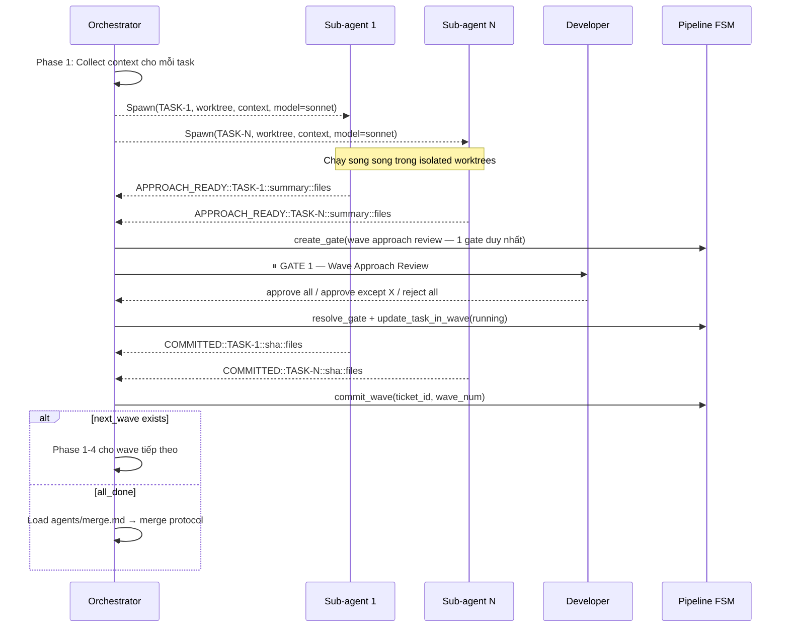

# SPAWNER — Parallel Agent Orchestration

Spawner là module của Orchestrator, được kích hoạt khi pipeline có từ 2 tasks trở lên
có thể chạy song song. Spawner dùng Claude Code's `Agent` tool để spawn N sub-agents
đồng thời trong N git worktrees riêng biệt.

## Khi nào kích hoạt

Orchestrator kích hoạt Spawner khi **tất cả** điều kiện sau thỏa:

```
1. Wave plan tồn tại (PM đã chạy dependency analysis)
2. Wave hiện tại có ≥ 2 tasks
3. FSM state = DEV_PARALLEL_RUNNING
4. Không có BLOCKED task nào từ wave trước
```

Single-task wave → dùng `/morai:dev` trực tiếp (không qua Spawner).

---

## Tổng quan luồng Spawner



---

## Spawner Protocol

### Phase 1 — Chuẩn bị context cho sub-agents

Trước khi spawn, Orchestrator collect đủ context cho mỗi task:

```
Với mỗi task_id trong wave hiện tại:
  1. morai-file: read_file("tasks/<ticket_id>/<task_id>.json")
  2. morai-file: read_file("specs/<ticket_id>.md")
  3. morai-file: read_file("designs/<ticket_id>-detail.md")  ← nếu có
  4. morai-rag:  search(task.description, namespace=project)  ← relevant code patterns
  5. morai-file: read_file(".morai/knowledge/conventions.md") ← coding conventions
```

Sub-agent sẽ KHÔNG có access đến conversation history của Orchestrator.
Mọi context cần thiết phải nằm trong prompt.

### Phase 2 — Spawn song song

Gọi `Agent` tool **N lần trong cùng 1 response** để đảm bảo parallel execution.

Model selection dựa vào task size (đọc từ `task.json`):
- `size: S` → `model="sonnet"` (implement cần quality, không downgrade haiku)
- `size: M` → `model="sonnet"`
- `size: L` → `model="sonnet"`

```
[Message với N Agent tool calls đồng thời]
  Agent(task=TASK-1, worktree="feat/PROJ-123-task-1", context=..., model="sonnet")
  Agent(task=TASK-3, worktree="feat/PROJ-123-task-3", context=..., model="sonnet")
  Agent(task=TASK-5, worktree="feat/PROJ-123-task-5", context=..., model="sonnet")
```

> Review/test sub-agents (nếu spawned sau merge) → `model="haiku"` cho ticket size S/XS.

**Sub-agent prompt template:**

```
You are a Dev Agent (guided mode) for task {task_id} in ticket {ticket_id}.
You are running in git worktree: {worktree_path} on branch {worktree_branch}

=== TASK ===
{task_json}

=== SPEC (relevant sections) ===
{spec_excerpt}

=== DESIGN (if available) ===
{design_excerpt}

=== RELEVANT CODE PATTERNS ===
{rag_results}

=== CONVENTIONS ===
{conventions}

=== INSTRUCTIONS ===
Follow /morai:dev (guided mode) protocol:
1. Research codebase trong worktree này
2. Present approach tại GATE 1 — format:
   APPROACH_READY::{task_id}::{approach_summary}::{files_to_change}
3. Wait — do NOT implement until Orchestrator gives green light
4. After approval: implement chunk by chunk
5. When done: commit với message "feat({task_id}): {description}"
6. DO NOT push, DO NOT create PR — Orchestrator handles merge
7. Report final status:
   COMMITTED::{task_id}::{commit_sha}::{files_changed}

=== PERMISSIONS ===
- write_source_file: allowed (source code in worktree)
- write_file: allowed (artifact paths)
- git commit: allowed
- git push: DENIED — Orchestrator merges
- create_pr: DENIED — Orchestrator creates single PR
```

### Phase 3 — GATE 1 Aggregation (Approach Review — formal gate)

Sub-agents báo approach qua output format `APPROACH_READY::{task_id}::...`

Khi **tất cả** sub-agents trong wave báo `APPROACH_READY`:

1. Orchestrator gọi `morai-pipeline: get_wave_status(wave_num)` → lấy tất cả approaches
2. **Judge check** — cross-task drift/conflict trước khi tạo gate (independent, tránh self-judge):

```python
judge_result = Agent(
    subagent_type="morai:judge",
    description="Cross-task drift check trước Wave GATE 1",
    prompt=f"""
    Wave {wave_num} approaches từ {len(tasks)} sub-agents:
    {"\n\n".join(f"### {tid}\n{approach}" for tid, approach in wave_status["approaches"].items())}

    Task assignments ban đầu: tasks/{ticket_id}/<task_id>.json mỗi task

    Áp dụng Stuck Pattern 2 (Goal Drift):
    - Mỗi approach có còn bám sát task assignment ban đầu không?
    - Có 2 approach nào conflict (cùng sửa 1 file theo hướng khác nhau, hoặc duplicate logic) không?

    Verdict: "pass" hoặc "concern: <giải thích, liệt kê task_id liên quan>".
    """
)
```

- `pass` → tiếp tục bước 3, không thêm gì vào gate
- `concern: ...` → thêm `judge_note` vào context của gate (bước 3) để Dev thấy ngay khi review
- `morai:judge` lỗi/unavailable → log `[degraded] morai:judge unavailable, skip cross-task check` → tiếp tục bước 3 bình thường

3. Tạo **1 gate duy nhất** cho toàn bộ wave:

```python
gate = morai-pipeline: create_gate(
    ticket_id=$TICKET_ID,
    gate_type="REVIEW",
    question=f"Wave {wave_num} Approach Review ({len(tasks)} tasks parallel)",
    context="\n\n".join([
        f"### {tid}\n{approach}"
        for tid, approach in wave_status["approaches"].items()
    ]) + (f"\n\n⚠️ **Judge note**: {judge_note}" if judge_note else ""),
    options=["approve all", "approve all except: TASK-X", "reject all"],
    timeout_minutes=120,
)
```

4. Hiển thị theo format hitl.md — 1 block duy nhất, không phải N interruptions
5. Dev respond:
   - `"approve all"` → resolve gate → unblock tất cả sub-agents tiếp tục
   - `"approve all except: TASK-2"` → resolve gate → unblock TASK-1, TASK-3; block TASK-2
   - `"reject all"` → resolve gate → abort wave, block pipeline

Cập nhật wave status:
```python
# Với mỗi task được approved:
morai-pipeline: update_task_in_wave(ticket_id, wave_num, task_id, "running")
```

### Phase 4 — Monitor và Collect kết quả

Sub-agents report committed qua format `COMMITTED::{task_id}::{commit_sha}::...`

Orchestrator update pipeline khi nhận report:
```
morai-pipeline: update_task_in_wave(ticket_id, wave_num, task_id, "committed",
  commit_sha=sha, files_changed=files)
```

Khi tất cả tasks trong wave committed:
```
wave_status = morai-pipeline: get_wave_status(wave_num)
if wave_status.all_committed:
    → Phase 5 (Merge)
```

### Phase 5 — Advance to Next Wave hoặc Merge

```
result = morai-pipeline: commit_wave(ticket_id, wave_num)

if result.next_wave:
    # Có wave tiếp theo
    start_wave(ticket_id, result.next_wave)
    → lặp lại Phase 1-4 cho wave tiếp

if result.all_done:
    # Tất cả waves xong → Merge
    → agents/merge.md protocol
```

---

## Failure Handling

| Tình huống | Xử lý |
|------------|-------|
| Sub-agent timeout | Mark task `blocked`, tiếp tục tasks khác trong wave |
| Sub-agent báo conflict | Orchestrator escalate Dev, pause wave |
| GATE 1 reject một task | Block task đó, approve + tiếp tục tasks còn lại |
| Merge conflict (Phase 5) | → agents/merge.md conflict resolution |
| Tất cả tasks trong wave fail | Transition pipeline → BLOCKED, notify Dev |

---

## Tracking trong pipeline state

Orchestrator update FSM sau mỗi phase quan trọng:

```
Bắt đầu wave:     transition(DEV_PARALLEL_RUNNING, context={current_wave: N})
Tất cả committed: transition(DEV_ALL_COMMITTED)   ← sau merge xong
```
