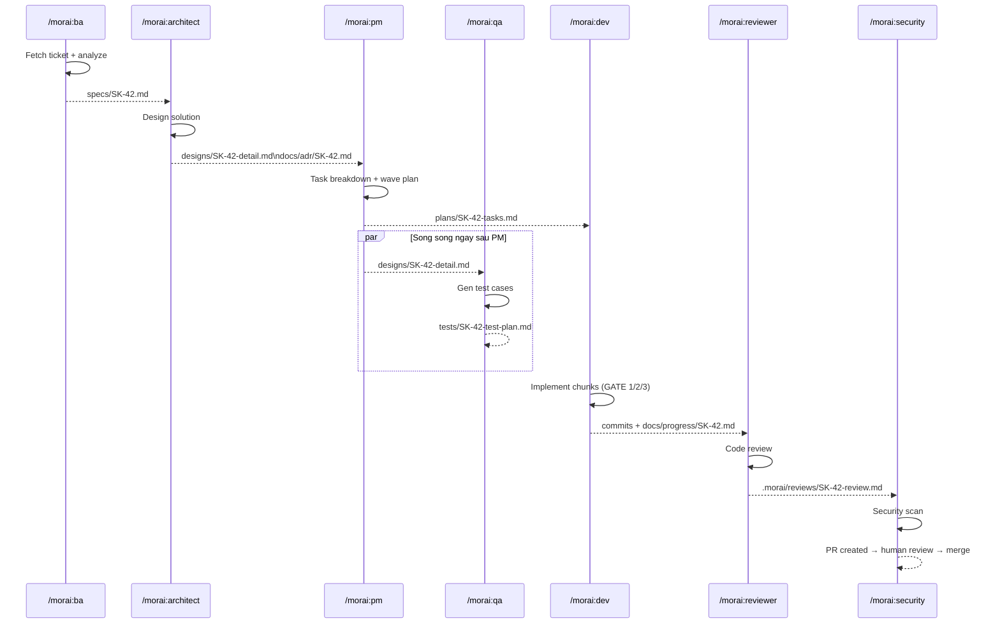

# Handoff Rules — Pipeline Contract

Mỗi skill trong pipeline viết output ra file. Skill tiếp theo đọc file đó làm input. Đây là contract bắt buộc — không bypass.

---

## Output paths

| Skill | Output path |
|-------|-------------|
| `/morai:ba` | `specs/<ticket-id>.md` |
| `/morai:architect` | `designs/<ticket-id>-detail.md` + `docs/adr/<ticket-id>.md` |
| `/morai:pm` | `plans/<ticket-id>-tasks.md` + `tasks/<ticket-id>/` |
| `/morai:dev` | git commits (no separate file) + `docs/progress/<ticket-id>.md` |
| `/morai:reviewer` | `.morai/reviews/<ticket-id>-review.md` |
| `/morai:security` | `.morai/reviews/<ticket-id>-security.md` |
| `/morai:qa` | `tests/<ticket-id>-test-plan.md` |

---

## Rules

### 1. Mỗi skill PHẢI kiểm tra input file trước khi chạy

Ví dụ: `/morai:architect` đọc `specs/<ticket-id>.md`. Nếu file không tồn tại → STOP và in:

```
❌ Spec không tìm thấy: specs/<ticket-id>.md
   Chạy /morai:ba <ticket-id> trước.
```

Không assume, không proceed với thông tin không đủ.

### 2. Mỗi skill PHẢI kết thúc bằng "ready for next" message

Format chuẩn:

```
✅ <skill> done — <ticket-id>

Output: <path-to-file>

Bước tiếp: chạy /morai:<next-skill> <ticket-id>
```

### 3. STOP khi còn open questions

Trong BA và Architect phase: nếu còn open questions blocking → skill in danh sách câu hỏi, DỪNG, không tự advance.

### 4. Không skip phase

- Feature mới: đi đủ ba phase BA → Architect → PM → Dev → Reviewer
- Bug nhỏ (< 50 lines diff): có thể skip Architect; KHÔNG skip BA và Reviewer
- Emergency hotfix: có thể skip Architect; ghi lý do vào commit message

### 5. Cross-skill trigger

Sau `/morai:architect` xong → nhắc user có thể chạy `/morai:qa` **song song** ngay,
không cần chờ Dev code xong. QA gen test cases từ design doc, không từ code.

---

## End-to-end example


