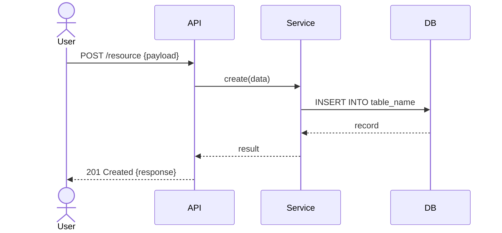

# [Ticket ID] — Detail Design

## Metadata

| Field  | Value                              |
| ------ | ---------------------------------- |
| Ticket | [PROJ-XXX]                         |
| Spec   | `specs/PROJ-XXX.md`                |
| ADR    | `docs/adr/PROJ-XXX.md` (nếu có)   |
| Author |                                    |
| Date   |                                    |
| Status | Draft \| Review \| Approved        |

## Overview

[Mô tả ngắn: feature này làm gì, phạm vi của tài liệu này — không copy từ spec, chỉ ghi những quyết định design cụ thể]

---

## Data Model

### New / Modified Tables

```sql
-- Table: table_name
CREATE TABLE table_name (
    id         BIGSERIAL PRIMARY KEY,
    -- columns...
    created_at TIMESTAMPTZ NOT NULL DEFAULT NOW(),
    updated_at TIMESTAMPTZ NOT NULL DEFAULT NOW()
);

-- Indexes
CREATE INDEX idx_table_name_col ON table_name (col);
```

### Enum / Constants

```sql
CREATE TYPE status_enum AS ENUM ('active', 'inactive', 'pending');
```

### Migration

| Direction | Mô tả |
| --------- | ----- |
| Up        |       |
| Down      |       |

---

## API Design

### Endpoints

#### `METHOD /api/v1/resource`

**Request**

```json
{
  "field": "type — mô tả, required/optional, validation rule"
}
```

**Response 200**

```json
{
  "id": "string",
  "field": "value"
}
```

**Error Responses**

| Status | Error Code       | Condition              |
| ------ | ---------------- | ---------------------- |
| 400    | VALIDATION_ERROR | Input không hợp lệ     |
| 401    | UNAUTHORIZED     | Thiếu / sai auth token |
| 403    | FORBIDDEN        | Không có quyền         |
| 404    | NOT_FOUND        | Resource không tồn tại |
| 409    | CONFLICT         | Duplicate / race       |
| 500    | INTERNAL_ERROR   | Lỗi server             |

---

## Module / Class Design

### `package/module`

```
ClassName
├── method_one(param: Type) → ReturnType
│   Mô tả logic chính, invariants
└── method_two(param: Type) → ReturnType
    Mô tả logic chính, invariants
```

> Chỉ list những class/method mới hoặc bị thay đổi đáng kể.

---

## Sequence Diagram



---

## Error Handling Matrix

| Scenario              | Behavior                      | Log Level | Message ra ngoài                   |
| --------------------- | ----------------------------- | --------- | ---------------------------------- |
| DB connection lost    | Retry 3x → 503                | ERROR     | "Service temporarily unavailable"  |
| Validation fail       | 400, field-level errors       | WARN      | Chi tiết lỗi từng field            |
| Third-party timeout   | Retry với exponential backoff | WARN      | "Try again later"                  |
| Unexpected exception  | 500, log full stack trace     | ERROR     | "An unexpected error occurred"     |

---

## Non-functional Requirements

### Performance

| Metric           | Target   |
| ---------------- | -------- |
| Throughput       |          |
| Latency (p99)    |          |
| Caching strategy | None / … |

### Security

| Item             | Value                                    |
| ---------------- | ---------------------------------------- |
| Auth required    | Yes / No                                 |
| Permission/Role  |                                          |
| Data sensitivity | Public / Internal / Confidential / Secret |
| PII fields       |                                          |

---

## File Impact

### L1 — Direct (files solution này tạo/sửa/xóa trực tiếp)

| File | Action (create/modify/delete) | Mô tả |
|------|------------------------------|-------|
|      |                              |       |

### L2 — Ripple (files import/call những gì L1 thay đổi)

| File | Lý do bị ảnh hưởng |
|------|---------------------|
|      |                     |

### L3 — Contract (API spec, DB schema, shared types bị đổi)

| Artifact | Loại thay đổi | Consumers bị ảnh hưởng |
|----------|---------------|------------------------|
|          |               |                        |

### L4 — System (ENV vars, infra, external consumers)

| Item | Thay đổi cần làm |
|------|------------------|
|      |                  |

---

## Chunk Plan

| # | Type | Chunk | AC-IDs | Test files (viết trước) | Source files (viết sau) | Verify command | Est. | Impact layer | Test focus |
|---|------|-------|--------|-------------------------|-------------------------|----------------|------|--------------|------------|
| 1 | types | | | | | | | L3 Contract | |
| 2 | logic | | | | | | | L1 Direct | |

> Mọi AC-ID từ spec phải xuất hiện trong ít nhất 1 chunk.
> Verify command phải là exact shell command, copy-paste được.
> Est. theo format: `Xh` — flag chunk ≥ 6h để xem xét tách nhỏ.

### Reference: Verify command theo chunk type

| Chunk type | Verify command | Giải thích |
|------------|----------------|------------|
| `setup` | `<TEST_CMD> --version` | Chỉ verify test framework install được |
| `types` | `<TYPE_CHECK_CMD>` | Type check toàn bộ — phát hiện type mismatch ngay |
| `migration` | `<RUN_PREFIX> migrate up && <RUN_PREFIX> migrate down` | Verify up/down đều chạy được |
| `logic` / `ripple` | `<TEST_CMD> --testPathPattern=<chunk_files>` | Scoped test — chỉ files của chunk này |
| `integration` | `<LINT_CMD> && <TYPE_CHECK_CMD> && <TEST_CMD>` | Full suite — lint + type + toàn bộ tests |
| `config` | `<TYPE_CHECK_CMD>` + kiểm tra ENV vars có trong `.env.example` | |
| `cleanup` | `<LINT_CMD> && <TEST_CMD>` | Không regression sau cleanup |

> Điền command cụ thể vào bảng Chunk Plan, không để placeholder như `<TEST_CMD>`.
> Ví dụ: `pytest tests/services/filter_test.py` thay vì `<TEST_CMD scoped>`.

### Reference: Test focus theo chunk type

| Chunk type | Test focus tối thiểu |
|------------|----------------------|
| `setup` | Test framework khởi động được, chạy 1 dummy test pass |
| `types` | Valid shape compile; thiếu required field → compile/type error |
| `migration` | Up tạo đúng schema; Down revert sạch; Up lại idempotent |
| `config` | App parse config đúng; thiếu required ENV → startup error |
| `logic` | Happy path; null/empty input; boundary value (max/min/0); error case với exact error type |
| `ripple` | Caller truyền đúng input; response shape không đổi so với trước |
| `integration` | Full flow happy path end-to-end; tính năng lân cận không bị break |
| `cleanup` | — (behavior không đổi, full suite pass là đủ) |

---

## Readiness State

| # | Criterion | Status | Ghi chú |
|---|-----------|--------|---------|
| 1 | AC-IDs — mọi AC có ≥1 chunk | ⬜ | |
| 2 | File paths concrete — L1 không có "TBD" | ⬜ | |
| 3 | Verify commands runnable — exact shell commands | ⬜ | |
| 4 | Open questions resolved | ⬜ | |
| 5 | Chunk size ≤ 8h | ⬜ | |
| 6 | Risks mitigated | ⬜ | |
| 7 | Migration plan đầy đủ (nếu có migration chunk) | ⬜ / N/A | |

**Overall:** 🟢 READY | 🟡 PROCEED WITH CAUTION | 🔴 BLOCKED

---

## Implementation Notes

[Ghi cụ thể cho Dev: gotcha, dependency nào cần setup trước, patterns nên follow]

---

## Open Questions

| # | Question | Owner | Due | Status |
| - | -------- | ----- | --- | ------ |
| 1 |          |       |     | Open   |
