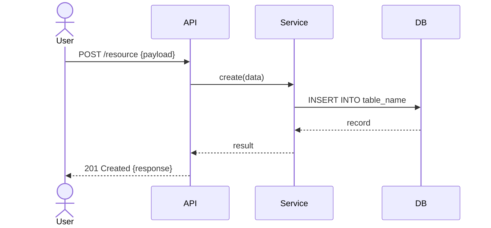

# [Ticket ID] — Detail Design

## Metadata

| Field  | Value                              |
| ------ | ---------------------------------- |
| Ticket | [PROJ-XXX]                         |
| Spec   | `specs/PROJ-XXX.md`                |
| ADR    | `docs/adr/PROJ-XXX.md` (nếu có)   |
| Author |                                    |
| Date   |                                    |
| Status | Draft \| Review \| Approved        |

## Overview

[Mô tả ngắn: feature này làm gì, phạm vi của tài liệu này — không copy từ spec, chỉ ghi những quyết định design cụ thể]

---

## Data Model

### New / Modified Tables

```sql
-- Table: table_name
CREATE TABLE table_name (
    id         BIGSERIAL PRIMARY KEY,
    -- columns...
    created_at TIMESTAMPTZ NOT NULL DEFAULT NOW(),
    updated_at TIMESTAMPTZ NOT NULL DEFAULT NOW()
);

-- Indexes
CREATE INDEX idx_table_name_col ON table_name (col);
```

### Enum / Constants

```sql
CREATE TYPE status_enum AS ENUM ('active', 'inactive', 'pending');
```

### Migration

| Direction | Mô tả |
| --------- | ----- |
| Up        |       |
| Down      |       |

---

## API Design

### Endpoints

#### `METHOD /api/v1/resource`

**Request**

```json
{
  "field": "type — mô tả, required/optional, validation rule"
}
```

**Response 200**

```json
{
  "id": "string",
  "field": "value"
}
```

**Error Responses**

| Status | Error Code       | Condition              |
| ------ | ---------------- | ---------------------- |
| 400    | VALIDATION_ERROR | Input không hợp lệ     |
| 401    | UNAUTHORIZED     | Thiếu / sai auth token |
| 403    | FORBIDDEN        | Không có quyền         |
| 404    | NOT_FOUND        | Resource không tồn tại |
| 409    | CONFLICT         | Duplicate / race       |
| 500    | INTERNAL_ERROR   | Lỗi server             |

---

## Module / Class Design

### `package/module`

```
ClassName
├── method_one(param: Type) → ReturnType
│   Mô tả logic chính, invariants
└── method_two(param: Type) → ReturnType
    Mô tả logic chính, invariants
```

> Chỉ list những class/method mới hoặc bị thay đổi đáng kể.

---

## Sequence Diagram



---

## Error Handling Matrix

| Scenario              | Behavior                      | Log Level | Message ra ngoài                   |
| --------------------- | ----------------------------- | --------- | ---------------------------------- |
| DB connection lost    | Retry 3x → 503                | ERROR     | "Service temporarily unavailable"  |
| Validation fail       | 400, field-level errors       | WARN      | Chi tiết lỗi từng field            |
| Third-party timeout   | Retry với exponential backoff | WARN      | "Try again later"                  |
| Unexpected exception  | 500, log full stack trace     | ERROR     | "An unexpected error occurred"     |

---

## Non-functional Requirements

### Performance

| Metric           | Target   |
| ---------------- | -------- |
| Throughput       |          |
| Latency (p99)    |          |
| Caching strategy | None / … |

### Security

| Item             | Value                                    |
| ---------------- | ---------------------------------------- |
| Auth required    | Yes / No                                 |
| Permission/Role  |                                          |
| Data sensitivity | Public / Internal / Confidential / Secret |
| PII fields       |                                          |

---

## Implementation Notes

[Ghi cụ thể cho Dev: file nào cần tạo/sửa, thứ tự implement, gotcha, dependency nào cần setup trước]

---

## Open Questions

| # | Question | Owner | Due | Status |
| - | -------- | ----- | --- | ------ |
| 1 |          |       |     | Open   |
